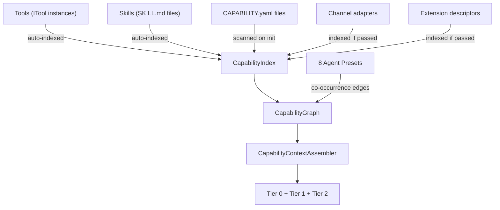

# Capability Discovery

Wunderland agents can access 23+ tools, 18 skills, 20+ extensions, and 28 messaging channels. Loading all of those definitions into every LLM call wastes tokens and degrades inference quality. The Capability Discovery Engine replaces static loading with on-demand semantic search so agents only see the capabilities relevant to the current conversation.

## How It Works

When a user message arrives, the engine runs a three-stage pipeline:

```
"search the web for AI news"
        |
   Semantic Search ── embed query, find nearest capabilities
        |
   Graph Re-ranking ── boost related capabilities (co-occurrence, shared skills)
        |
   Tiered Context   ── allocate token budget across three detail levels
        |
   ~1,800 tokens of relevant capability context (down from ~20k)
```

**Semantic search** finds candidates by embedding similarity. **Graph re-ranking** adjusts scores using relationship data -- capabilities that share dependencies or belong to the same skill group get boosted together. **Tiered context budgeting** controls how much detail each capability gets:

| Tier | Detail Level | ~Tokens | When Used |
|------|-------------|---------|-----------|
| **Full** | Complete schema, examples, error handling | ~400 | Top 1-3 most relevant matches |
| **Standard** | Parameters, return type, usage hints | ~150 | Next 3-5 matches |
| **Brief** | Name and one-line description | ~40 | Remaining matches |

The agent can promote a brief-tier capability to full detail mid-conversation by calling the `discover_capabilities` meta-tool.

## Tools, Skills, Extensions & Channels

The discovery engine indexes four kinds of capability into a unified `CapabilityDescriptor` model. Each gets a kind-prefixed ID (e.g., `tool:web_search`, `skill:github`) and lives in the same index and graph:



### What's Automatic vs Manual

| Source | Auto-indexed? | How |
|--------|:---:|---|
| Tools (`ITool`) | Yes | From `toolMap` passed to `WunderlandDiscoveryManager.initialize()` |
| Skills (`SKILL.md`) | Yes | From `skillEntries` passed to `initialize()` |
| `CAPABILITY.yaml` manifests | Yes | Scanned from `~/.wunderland/capabilities/` and `./.wunderland/capabilities/` |
| Preset co-occurrences | Yes | Auto-derived from the 8 agent presets at startup |
| Extension descriptors | Manual | Must be passed as `CapabilityIndexSources.extensions` |
| Channel adapters | Manual | Must be passed as `CapabilityIndexSources.channels` |

When you add a new skill to `@framers/agentos-skills-registry` or a new tool extension package, it will be picked up automatically the next time an agent starts -- no configuration changes needed. Custom capabilities defined via `CAPABILITY.yaml` in `~/.wunderland/capabilities/` are also scanned automatically on startup.

## Skills vs Extensions

Skills and extensions are **separate systems** that both feed into the discovery graph:

- **Skills** are prompt-level `SKILL.md` files that teach an agent _when_ and _how_ to use tools. They become `CapabilityDescriptor` entries with `kind: 'skill'` and ID format `skill:<name>` (e.g., `skill:github`, `skill:web-search`).

- **Extensions** are runtime code packages (12 kinds: tools, guardrails, workflows, etc.). Tool extensions become `CapabilityDescriptor` entries with `kind: 'tool'` and ID format `tool:<name>` (e.g., `tool:web_search`, `tool:giphy_search`).

Both live in the same discovery index and graph. Skills provide behavioral guidance ("search for recent results, cite sources"); tools provide callable actions ("execute a web search with these parameters"). **You do not need a skill for every tool** -- many tools work fine with just their schema and description.

When a skill references a required tool (e.g., the `web-search` skill depends on the `web_search` tool), the graph creates a `DEPENDS_ON` edge between them. This means searching for "search the web" finds both the tool schema and the skill instructions, with the skill boosted by its graph connection to the matching tool.

### Best Practices

- **Use skills** when a tool needs behavioral guidelines beyond its schema -- rate limiting, output formatting, multi-step workflows, or platform-specific instructions.
- **Skip skills** for tools with clear, self-documenting schemas -- the tool's name, description, and input schema are often sufficient.
- **Use `CAPABILITY.yaml`** for custom or internal tools that aren't in the curated registry -- this makes them discoverable without writing a full extension package.
- **Set `relationships`** in `CAPABILITY.yaml` to connect capabilities that are commonly used together -- the graph re-ranker will boost them as a group.

## For Agent Creators

### Configuring Discovery in Presets

Agent presets already declare `suggestedSkills` and `suggestedExtensions`. These feed directly into the discovery engine's relationship graph, giving those capabilities a baseline score boost:

```json
{
  "name": "research-assistant",
  "suggestedSkills": ["web-search", "summarize", "deep-research"],
  "suggestedExtensions": ["content-extraction", "news-search"],
  "discovery": {
    "enabled": true,
    "tokenBudget": 2500,
    "graphWeight": 0.4
  }
}
```

When an agent is scaffolded from this preset, the discovery engine pre-indexes the suggested capabilities and gives them a graph-weight advantage. They still need to score above the relevance threshold to appear in context -- they are not force-included.

### Discovery in agent.config.json

For agents created without a preset, configure discovery directly:

```json
{
  "skills": ["web-search", "github", "coding-agent"],
  "extensions": ["browser-automation", "credential-vault"],
  "discovery": {
    "enabled": true,
    "tokenBudget": 2000,
    "maxResults": 15,
    "tierThresholds": {
      "full": 0.85,
      "standard": 0.65
    }
  }
}
```

| Option | Default | Description |
|--------|---------|-------------|
| `tokenBudget` | `2000` | Max tokens for capability context per turn |
| `maxResults` | `15` | Max capabilities to include |
| `tierThresholds.full` | `0.85` | Similarity score threshold for full-tier |
| `tierThresholds.standard` | `0.65` | Similarity score threshold for standard-tier |
| `graphWeight` | `0.3` | Influence of relationship graph on ranking (0-1) |
| `metaToolEnabled` | `true` | Allow the agent to call `discover_capabilities` mid-conversation |

Set `"enabled": false` to fall back to static capability loading for agents with a small, fixed toolset.

## Custom Capabilities

Define custom capabilities as `CAPABILITY.yaml` files. The engine scans two directories:

- **User-global**: `~/.wunderland/capabilities/`
- **Project-local**: `./.wunderland/capabilities/`

Project-local capabilities override user-global ones with the same name.

```yaml
name: internal-api-lookup
version: "1.0.0"
description: Query the internal REST API for customer and order data.
category: business-tools
tags:
  - api
  - internal
  - customer

parameters:
  type: object
  properties:
    endpoint:
      type: string
      description: API endpoint path (e.g., /customers, /orders)
    query:
      type: object
      description: Query parameters as key-value pairs
  required:
    - endpoint

relationships:
  - credential-vault
  - web-browser

examples:
  - endpoint: "/customers"
    query: { "email": "user@example.com" }
    description: Find a customer by email
```

The `relationships` field tells the graph re-ranker which other capabilities tend to be useful alongside this one. When `internal-api-lookup` scores high, `credential-vault` and `web-browser` get a boost too.

## CLI Integration

The `wunderland chat` command enables discovery automatically when the agent has more than 10 registered capabilities. You can control this explicitly:

```bash
# Force discovery on
wunderland chat --discovery

# Force discovery off (static loading)
wunderland chat --no-discovery

# Set a custom token budget
wunderland chat --discovery --discovery-budget 3000
```

During a chat session, the engine logs discovery decisions at the `debug` level:

```
[discovery] Query: "search the web for AI news"
[discovery] Matched 11 capabilities in 14ms (warm cache)
[discovery] Tiers: 2 full, 3 standard, 6 brief → 1,640 tokens
```

Enable debug logging with `--verbose` or `LOG_LEVEL=debug` to see these.

## Performance

Benchmarked on a full Wunderland agent catalog (45 capabilities):

| Metric | Value |
|--------|-------|
| Cold discovery latency | ~120ms |
| Warm discovery latency | ~15ms |
| Token reduction | 89% (~20k to ~1.8k) |
| Top-3 precision | 0.91 |

The warm path uses a per-session embedding cache. The index builds once during agent startup and persists for the session lifetime. For agents with fewer than 10 capabilities, the overhead of discovery exceeds the token savings -- the engine disables itself automatically in that case.

## Library API Examples

### Load skills + extensions with discovery

```ts
import { createWunderland } from 'wunderland';

const app = await createWunderland({
  llm: { providerId: 'openai' },
  tools: 'curated',
  skills: ['github', 'web-search', 'coding-agent'],
  extensions: {
    tools: ['web-search', 'web-browser', 'giphy'],
    voice: ['voice-synthesis'],
  },
  // discovery is enabled by default — auto-indexes all tools + skills
});
```

### Load everything at once

```ts
const app = await createWunderland({
  llm: { providerId: 'openai' },
  tools: 'curated',
  skills: 'all',  // all 18 curated skills
  extensions: {
    tools: ['web-search', 'web-browser', 'news-search', 'image-search', 'giphy', 'cli-executor'],
    voice: ['voice-synthesis'],
  },
});
```

### Use a preset (auto-configures everything)

```ts
const app = await createWunderland({
  llm: { providerId: 'openai' },
  preset: 'research-assistant',  // auto-loads recommended tools, skills, extensions
});
```

### Check what discovery indexed

```ts
const diag = app.diagnostics();
console.log(diag.tools.names);   // ['web_search', 'giphy_search', ...]
console.log(diag.skills.names);  // ['github', 'web-search', ...]
console.log(diag.discovery);     // { initialized: true, capabilityCount: 25, graphEdges: 42, ... }
```

## Related Guides

- [Skills System](./skills-system.md) -- curated skills that feed into discovery
- [Extensions](./extensions.md) -- extension ecosystem and registry
- [Channels](./channels.md) -- messaging channel system
- [Guardrails](./guardrails.md) -- security controls for capability execution
- [Inference Routing](./inference-routing.md) -- how discovered capabilities interact with model selection
