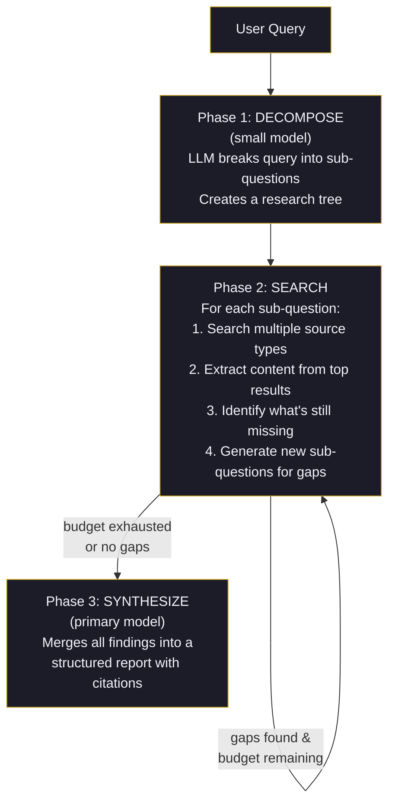

# Deep Research & Query Classification

Ask an agent "what's 2+2" and it should answer instantly. Ask it "what are the latest treatment options for drug-resistant tuberculosis" and it should go dig through medical literature, cross-reference sources, identify gaps, and come back with citations.

The problem: most agents treat both queries the same way. Either they web-search everything (slow, wasteful) or they never search at all (hallucinate freely).

Wunderland solves this with an LLM-as-judge classifier that runs *before* the main LLM turn. A cheap, fast model (gpt-4o-mini, claude-haiku, or qwen2.5:3b) inspects the query and assigns a research depth tier. The agent then behaves accordingly.

## Research Depth Tiers

| Tier | When it triggers | What happens | Budget |
|------|-----------------|--------------|--------|
| `none` | Greetings, simple facts, code help, creative writing | LLM answers from training data. No tools called. | 0s, 0 searches |
| `quick` | Weather, stock price, "what is X", latest news | 1-2 web searches, cite sources | 30s, 10 searches |
| `moderate` | Product comparisons, travel recs, "best X for Y" | Multi-source research with `researchAggregate` or `researchInvestigate` | 2min, 20 searches |
| `deep` | Medical, legal, scientific, financial planning, learning plans | Full `deep_research` pipeline: decompose, search, extract, gap-analyze, synthesize | 9min, 50 searches |

The classifier defaults to `none` on failure. A broken classifier never blocks the main conversation.

## The Research Tools

Six tools form the research stack, from lightweight to heavy:

| Tool | Purpose | Side effects |
|------|---------|-------------|
| `web_search` | Single web search query | None |
| `news_search` | Search recent news articles | None |
| `researchInvestigate` | Targeted investigation of a specific topic | None |
| `researchAcademic` | Search academic papers and scholarly sources | None |
| `researchAggregate` | Aggregate findings across multiple search results | None |
| `deep_research` | Full 3-phase pipeline with recursive decomposition | None |

The classifier decides which tools to inject into the prompt based on the depth tier. `quick` gets `web_search` and `news_search`. `moderate` gets `researchAggregate` and `researchInvestigate`. `deep` triggers the full `deep_research` tool.

## The 3-Phase Deep Research Pipeline

When `deep_research` runs, it follows a structured process:



Phase 2 iterates. Each iteration searches, extracts, analyzes gaps, and optionally spawns child queries to fill those gaps. The number of iterations depends on depth:

| Depth | Default iterations | Max searches | Max extractions | Max LLM calls | Time limit |
|-------|--------------------|-------------|-----------------|---------------|------------|
| `quick` | 1 | 10 | 5 | 3 | 30s |
| `moderate` | 3 | 20 | 10 | 8 | 2 min |
| `deep` | 6 | 50 | 25 | 20 | 9 min |

A `ResearchBudgetTracker` enforces hard caps on all dimensions. When any budget is exhausted, the engine moves to synthesis with whatever findings it has.

## LLM-as-Judge Auto-Classifier

Enabled by default. Before every chat turn, the classifier runs a fast LLM call with a structured prompt:

```
You are a query complexity classifier. Given a user query, classify it
into ONE of these research depth tiers: none, quick, moderate, deep.

Respond with ONLY a JSON object:
{"depth": "none|quick|moderate|deep", "reasoning": "one sentence why"}
```

The classifier uses the cheapest available model:
- OpenAI: `gpt-4o-mini`
- Gemini: `gemini-2.0-flash-lite`
- Ollama: `qwen2.5:3b`

Classification typically adds 200-400ms to the turn. The result is cached per query.

### Override Patterns

Explicit prefixes bypass the classifier entirely:

| Input | Resolved depth |
|-------|---------------|
| `/research what are the best hiking trails in Patagonia` | `moderate` |
| `/deep explain the neurochemistry of psilocybin` | `deep` |
| Regular message (no prefix) | Auto-classified |

## HTTP API

### Body Fields

```json
{
  "message": "What are the latest advances in mRNA vaccine technology?",
  "research": true
}
```

| `research` value | Effect |
|-----------------|--------|
| `true` | Forces `moderate` depth |
| `"deep"` | Forces `deep` depth |
| `"quick"` | Forces `quick` depth |
| omitted | Auto-classified (default) |

You can also disable auto-classification per request:

```json
{
  "message": "Hello",
  "autoClassify": false
}
```

### Streaming Research Progress

When `"stream": true` is set, research progress events are pushed as SSE:

```bash
curl -N -X POST http://localhost:3777/chat \
  -H "Content-Type: application/json" \
  -d '{"message": "Explain CRISPR gene editing safety concerns", "research": "deep", "stream": true}'
```

Progress events arrive as `event: progress` with a `SYSTEM_PROGRESS` payload:

```
event: progress
data: {"type":"SYSTEM_PROGRESS","toolName":"deep_research","phase":"decomposing","message":"Decomposing query into sub-questions","progress":0.1}

event: progress
data: {"type":"SYSTEM_PROGRESS","toolName":"deep_research","phase":"searching","message":"Searching sources \"CRISPR off-target effects\" (iter 1/6, 3 findings)","progress":0.3}

event: reply
data: {"type":"REPLY","reply":"## CRISPR Gene Editing Safety Concerns\n\n..."}
```

See the [HTTP Streaming API](./http-streaming-api.md) guide for the full SSE protocol.

## Configuration

### agent.config.json

```json
{
  "research": {
    "autoClassify": true,
    "minDepthToInject": "quick"
  }
}
```

| Field | Type | Default | Description |
|-------|------|---------|-------------|
| `research.autoClassify` | `boolean` | `true` | Enable the LLM-as-judge classifier |
| `research.minDepthToInject` | `"none" \| "quick" \| "moderate" \| "deep"` | `"quick"` | Minimum classified depth before research tools are injected. Set to `"moderate"` to skip quick searches. |

Setting `autoClassify: false` disables all automatic research — the agent only researches when you explicitly use `/research`, `/deep`, or pass the `research` body field.

Setting `minDepthToInject: "moderate"` means queries classified as `quick` are answered from training data. Only `moderate` and `deep` queries trigger tool injection.

## Example Queries

| Query | Expected classification | Behavior |
|-------|----------------------|----------|
| "Hello, how are you?" | `none` | Direct LLM response |
| "What's the weather in Tokyo?" | `quick` | Single web search |
| "Best laptop for machine learning under $2000" | `moderate` | Multi-source comparison |
| "What are the treatment options for stage 3 non-small cell lung cancer?" | `deep` | Full research pipeline with medical literature |
| "/research top AI startups in 2026" | `moderate` (forced) | Multi-source research |
| "/deep history of the Byzantine Empire" | `deep` (forced) | Full pipeline |

## Key Files

| File | Purpose |
|------|---------|
| `packages/wunderland/src/runtime/research-classifier.ts` | LLM-as-judge classifier |
| `packages/agentos-extensions/registry/curated/research/deep-research/src/engine/DeepResearchTool.ts` | ITool wrapper for the engine |
| `packages/agentos-extensions/registry/curated/research/deep-research/src/engine/DeepResearchEngine.ts` | Core research pipeline |
| `packages/agentos-extensions/registry/curated/research/deep-research/src/engine/ResearchBudgetTracker.ts` | Budget enforcement |
| `packages/agentos-extensions/registry/curated/research/deep-research/src/engine/types.ts` | Type definitions |
| `packages/agentos-extensions/registry/curated/research/deep-research/src/tools/investigate.ts` | researchInvestigate tool |
| `packages/agentos-extensions/registry/curated/research/deep-research/src/tools/academic.ts` | researchAcademic tool |
| `packages/agentos-extensions/registry/curated/research/deep-research/src/tools/aggregate.ts` | researchAggregate tool |

## Related

- [HTTP Streaming API](./http-streaming-api.md) -- SSE protocol for progress events
- [Chat Server](./chat-server.md) -- HTTP API reference
- [Tools](./tools.md) -- Full tool catalog
- [Browser Automation](./browser-automation.md) -- Content extraction behind the scenes
