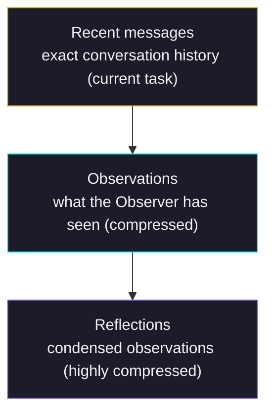
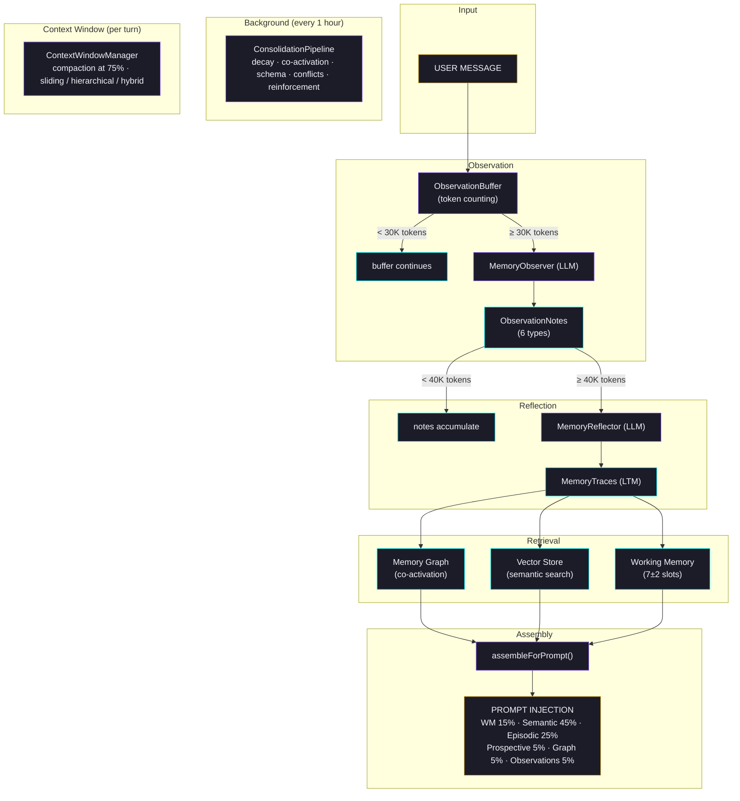

# Memory Architecture

Wunderland agents have a biologically-inspired memory system modeled after human cognition. Two background processes — an **Observer** and a **Reflector** — watch conversations and maintain a dense observation log that replaces raw message history as it grows. Memory behavior adapts to each agent's HEXACO personality traits and real-time emotional state.

## Overview

The memory system has three layers:

| Layer | Package | Purpose |
|-------|---------|---------|
| **Cognitive Memory** | `@framers/agentos` | Encoding, retrieval, working memory, observation, consolidation |
| **Agent Storage** | `wunderland` | Per-agent SQLite, personality-adaptive auto-ingest, tool failure learning |
| **Context Window** | `wunderland` | Infinite conversation support via compaction strategies |

All three layers are personality-aware (HEXACO) and mood-sensitive (PAD model).

## Quick Start

Memory is enabled by default. No configuration needed for basic usage:

```bash
wunderland init my-agent --local
cd my-agent
wunderland chat
```

The agent automatically:
- Persists conversation history across sessions
- Extracts and stores important facts from conversations
- Compacts context when approaching token limits
- Learns from tool failures and avoids repeating mistakes

To customize, add a `memory` section to `agent.config.json`:

```json
{
  "memory": {
    "infiniteContext": {
      "enabled": true,
      "strategy": "sliding",
      "compactionThreshold": 0.75,
      "preserveRecentTurns": 20
    }
  },
  "storage": {
    "autoIngest": {
      "enabled": true,
      "importanceThreshold": 0.4,
      "maxPerTurn": 3
    }
  }
}
```

## Observational Memory

Inspired by how humans remember — you don't recall every word of every conversation, you observe what happened, then your brain reflects and reorganizes into long-term memory.

### Observer (30K Token Threshold)

When accumulated conversation tokens exceed 30,000, the Observer extracts concise **observation notes** — factual, emotional, commitment, preference, creative, and correction types.

The Observer's personality affects what it notices:

| Trait | What the Observer Focuses On |
|-------|------------------------------|
| High emotionality | Emotional shifts and sentiment changes |
| High conscientiousness | Commitments, deadlines, action items |
| High openness | Creative tangents and exploratory ideas |
| High agreeableness | User preferences and rapport cues |
| High honesty | Corrections and retractions |

Example observations:
```
Date: 2026-03-15
- User is building a Next.js app with Supabase auth, due in 1 week
  - App uses server components with client-side hydration
  - User asked about middleware configuration for protected routes
  - User stated the app name is "Acme Dashboard"
```

Compression is typically **5-40x** — thousands of tokens of conversation become a few hundred tokens of observations.

### Reflector (40K Token Threshold)

When observations exceed 40,000 tokens, the Reflector condenses them — merging related items, elevating important facts to long-term memory traces, detecting conflicts, and resolving them based on personality.

**Conflict resolution:**
- High honesty (>0.6): prefer newer information
- High agreeableness (>0.6): keep both versions and note discrepancy
- Default: prefer higher confidence

The result is a three-tier system:



### Consolidation Pipeline (Hourly)

A background process runs every hour with five maintenance steps:

1. **Decay sweep** — apply Ebbinghaus forgetting curve, soft-delete traces below threshold (0.05)
2. **Co-activation replay** — create edges between traces sharing entities or temporal proximity
3. **Schema integration** — cluster episodic traces and summarize into semantic nodes
4. **Conflict resolution** — scan contradictions and resolve by confidence + personality
5. **Spaced repetition** — boost traces due for reinforcement

## Working Memory (Baddeley Model)

Based on Baddeley's cognitive model with **7±2 capacity-limited slots**. Each slot has an activation level that decays per turn. High-activation items stay in focus; low-activation items get evicted.

Personality modulates capacity:
- High openness (+1 slot): broader attention span
- High conscientiousness (-1 slot): deeper focus on fewer items

Slots are tagged as `[ACTIVE]`, `[fading]`, or `[weak]` in prompt injection.

## Memory Traces

Every memory is stored as a `MemoryTrace` — a universal envelope containing:

- **Content** — the actual memory text, entities, tags
- **Provenance** — source type (user statement, agent inference, tool result, observation, reflection), confidence score, verification count. Prevents confabulation.
- **Emotional context** — PAD model snapshot at encoding time (valence, arousal, dominance)
- **Ebbinghaus decay** — encoding strength, stability (grows on retrieval), retrieval count
- **Spaced repetition** — reinforcement interval (doubles on success)
- **Graph linkage** — associated trace IDs for spreading activation

### Encoding

When encoding a new memory:
- **Flashbulb memories**: high-emotion events (intensity > 0.8) get 2x encoding strength and 5x stability
- **Base strength**: 0.5 (decays over time)
- **Stability**: starts at 1 hour, grows with each retrieval

### Retrieval

Retrieval produces a composite score from 6 factors:
- Strength score (Ebbinghaus)
- Similarity score (embedding cosine)
- Recency score (temporal decay)
- Emotional congruence (mood-matching)
- Graph activation (spreading activation)
- Importance score

## Infinite Context Window

For "forever conversations" — automatic compaction when context approaches token limits.

### Configuration

```json
{
  "memory": {
    "infiniteContext": {
      "enabled": true,
      "strategy": "sliding",
      "compactionThreshold": 0.75,
      "preserveRecentTurns": 20,
      "transparencyLevel": "full",
      "maxSummaryChainTokens": 2000,
      "targetCompressionRatio": 8
    }
  }
}
```

### Compaction Strategies

| Strategy | Best For | How It Works |
|----------|----------|-------------|
| `sliding` (default) | Most conversations | Summarize oldest messages, keep recent raw |
| `hierarchical` | Very long sessions | Multi-level summary tree (L0→L1→L2), up to 1000x compression |
| `hybrid` | Best quality | Combines Observer + Reflector + narrative summary |

### Rolling Summary Chain

Compacted summaries form a linked chain:

```
[L2: turns 1-300]
  ├── [L1: turns 1-120]
  └── [L1: turns 121-300]
```

When the chain exceeds its token budget, oldest nodes merge into higher-level summaries.

### Transparency

Every compaction is logged with:
- Compression ratio
- Dropped content
- Preserved entities
- Traces created
- Duration

View with `/memory` in chat or check `getCompactionHistory()`.

## Auto-Ingest Pipeline

After each conversation turn, the pipeline extracts facts and stores them in the agent's vector store.

### Personality-Driven Behavior

| HEXACO Trait | Effect on Memory |
|-------------|------------------|
| **Openness > 0.6** | Lower importance threshold, +1 fact per turn, store emotional context |
| **Conscientiousness > 0.6** | Track action items, boost goals, increase compaction frequency |
| **Agreeableness > 0.6** | Boost user preferences, +2 retrieval results |
| **Emotionality > 0.6** | Enable sentiment tracking, store emotional context, boost episodic |
| **Honesty > 0.6** | Boost corrections, lower deduplication threshold |

### Fact Categories

- `user_preference` — what the user likes/dislikes
- `episodic` — what happened in the conversation
- `goal` — what the user wants to achieve
- `knowledge` — technical facts learned
- `correction` — corrections to prior beliefs
- `action_item` — things to do
- `emotional_context` — mood/sentiment observations

### Configuration

```json
{
  "storage": {
    "autoIngest": {
      "enabled": true,
      "importanceThreshold": 0.4,
      "maxPerTurn": 3
    }
  }
}
```

## Tool Failure Learning

When tools fail (browser blocked, API key missing, timeout), the `ToolFailureLearner` automatically records lessons into RAG memory.

6 failure patterns detected:
- Anti-bot (CAPTCHA, 403, Cloudflare) → "Use web_search or stealth_navigate"
- Empty content → "Site may block headless browsers"
- API key missing → "Check wunderland extensions info"
- Timeout → "Service may be down, try alternatives"
- Rate limit (429) → "Wait or switch provider"
- Ollama model missing → "Run wunderland ollama-setup"

Lessons are deduplicated per session and surfaced by RAG retrieval on future similar queries.

## HyDE Retrieval

[Hypothetical Document Embedding](/guides/hyde-retrieval) improves memory retrieval by generating a hypothetical answer before searching. Enabled by default.

```json
{
  "rag": {
    "hyde": {
      "enabled": true,
      "initialThreshold": 0.7,
      "minThreshold": 0.3,
      "adaptiveThreshold": true
    }
  }
}
```

## Storage

Each agent gets its own SQLite database at `~/.wunderland/agents/{seedId}/agent.db`.

Subsystems sharing the database:
- **Memory adapter** — conversation turn history
- **Vector store** (SqlVectorStore) — embeddings for semantic search
- **GraphRAG engine** — knowledge graphs (lazy-loaded)
- **State store** — persistent agent state

## Key Thresholds

| Parameter | Default | What It Controls |
|-----------|---------|-----------------|
| Observer activation | 30,000 tokens | When to extract observations |
| Reflector activation | 40,000 tokens | When to condense observations |
| Working memory capacity | 7 slots | Active focus items (±2 from personality) |
| Flashbulb threshold | 0.8 intensity | When to create strong emotional memories |
| Decay pruning | 0.05 strength | When to soft-delete faded memories |
| Recency half-life | 24 hours | How fast recency bonus decays |
| Consolidation interval | 1 hour | Background maintenance frequency |
| Context compaction | 75% full | When to compress context window |
| Preserve recent turns | 20 | Never compact last N turns |
| Auto-ingest threshold | 0.4 importance | Minimum importance to store a fact |
| Auto-ingest max per turn | 3 | Maximum facts extracted per turn |
| Deduplication | 0.85 similarity | Cosine threshold for dedup |

## Comparison with Mastra OM

| Feature | Mastra OM | Wunderland |
|---------|-----------|------------|
| Observer | 30K threshold | 30K threshold |
| Reflector | 40K threshold | 40K threshold |
| Working memory | N/A | Baddeley 7±2 slots |
| Personality-aware | No | Yes (HEXACO) |
| Mood-sensitive | No | Yes (PAD model) |
| Ebbinghaus decay | No | Yes |
| Spaced repetition | No | Yes |
| Knowledge graph | No | Yes (co-activation, spreading activation) |
| Compaction strategies | 1 (observer) | 3 (sliding, hierarchical, hybrid) |
| Flashbulb memories | No | Yes |
| Tool failure learning | No | Yes |
| HyDE retrieval | No | Yes |
| Thread/resource scope | Both | Per-agent (thread equivalent) |
| Async buffering | Yes | Via beforeTurn() |

## Architecture Diagram


