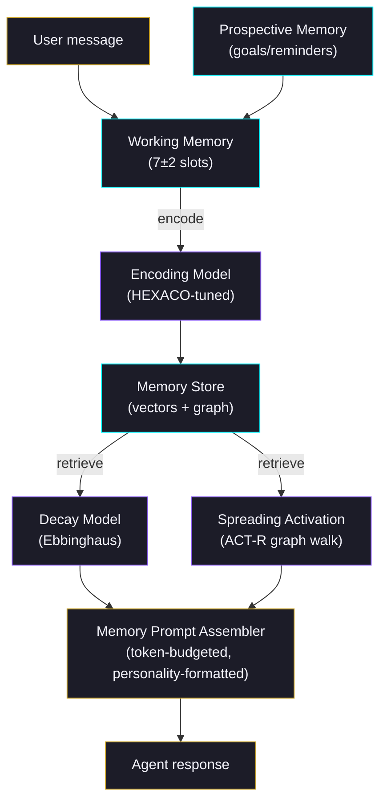

# Memory System

Wunderland agents remember. Not the way most chatbots "remember" — stuffing a conversation log into context until the window fills up and everything falls off a cliff. Wunderland implements a cognitive memory architecture grounded in six decades of memory research: Atkinson-Shiffrin's multi-store model, Baddeley's working memory, Tulving's long-term memory taxonomy, and Ebbinghaus's forgetting curve.

The result: agents that form memories, forget gracefully, consolidate knowledge overnight, and maintain coherent conversations that span weeks without context window limits.

## Architecture at a Glance



Every conversation turn runs through this pipeline: encode the new information, retrieve what's relevant, assemble it into the prompt within a strict token budget, and let decay naturally prune what's no longer needed.

## Memory Types

Wunderland follows Tulving's taxonomy. Each memory trace carries one of four types:

| Type | What it stores | Example |
|------|---------------|---------|
| `episodic` | Specific events with timestamps | "User asked about deploying to AWS on March 3" |
| `semantic` | General knowledge facts | "User prefers Python over JavaScript" |
| `procedural` | How-to knowledge | "To deploy, run `wunderland deploy --env production`" |
| `prospective` | Future intentions and reminders | "Remind user about the Monday deadline" |

### Scopes

Each trace also has a **scope** controlling its visibility:

- **`thread`** — visible only within one conversation
- **`user`** — persists across all conversations with a specific user
- **`persona`** — tied to the agent's personality/role
- **`organization`** — shared across all agents in an org

## Memory Traces

A `MemoryTrace` is the fundamental unit. Every memory the agent forms becomes one of these:

```typescript
interface MemoryTrace {
  id: string;
  type: 'episodic' | 'semantic' | 'procedural' | 'prospective';
  scope: 'thread' | 'user' | 'persona' | 'organization';
  content: string;
  entities: string[];
  tags: string[];

  // Where did this memory come from?
  provenance: {
    sourceType: 'user_statement' | 'agent_inference' | 'tool_result'
              | 'observation' | 'reflection' | 'external';
    confidence: number;        // 0–1
    verificationCount: number;
    contradictedBy?: string[];
  };

  // Emotional context (PAD model)
  emotionalContext: {
    valence: number;   // -1 to 1 (negative to positive)
    arousal: number;   // 0 to 1 (calm to excited)
    dominance: number; // -1 to 1 (submissive to dominant)
  };

  // Ebbinghaus decay parameters
  encodingStrength: number;
  stability: number;          // grows with each retrieval
  retrievalCount: number;
  lastAccessedAt: number;

  // Spaced repetition
  reinforcementInterval: number;
  nextReinforcementAt?: number;

  // Graph linkage
  associatedTraceIds: string[];
}
```

Source monitoring through `provenance` prevents confabulation — the agent knows whether a fact came from the user directly, from a tool result, or from its own inference. Contradictions are tracked explicitly.

## Encoding: How Memories Form

Not all information encodes equally. The `EncodingModel` determines how strongly a new memory imprints based on three factors:

### 1. Arousal (Yerkes-Dodson)

Encoding quality peaks at moderate emotional arousal. Too calm and information slips by. Too intense and encoding degrades. The system models this as an inverted-U curve.

### 2. HEXACO Personality Modulation

Each HEXACO trait tunes what the agent pays attention to:

| Trait | High score effect |
|-------|------------------|
| **Openness** | Stronger encoding of novel, unusual content |
| **Conscientiousness** | Stronger encoding of procedures, action items |
| **Emotionality** | Stronger encoding of emotional content |
| **Extraversion** | Stronger encoding of social interactions |
| **Agreeableness** | Stronger encoding of cooperative content |
| **Honesty** | Stronger encoding of corrections and ethical content |

An agent with high Openness (0.9) and low Conscientiousness (0.3) remembers creative ideas vividly but lets procedural details fade. The reverse personality remembers every step of a process but glosses over tangential insights.

### 3. Mood-Congruent Encoding

Content matching the agent's current emotional valence encodes 30% stronger. A frustrated agent remembers complaints more vividly. A curious agent remembers novel facts more readily.

### 4. Flashbulb Memories

When emotional intensity exceeds 0.8, encoding strength doubles. High-stakes moments — a critical error, a major breakthrough, an angry user — create vivid, persistent traces that resist decay.

**Combined formula:**

```
strength = base × yerksDodson(arousal) × attentionMultiplier
         × moodCongruenceBoost × emotionalSensitivity
```

## Decay: How Memories Fade

Wunderland implements Ebbinghaus's forgetting curve with spaced repetition. Every memory decays exponentially over time:

```
S(t) = S₀ · e^(-Δt / stability)
```

Where:
- `S₀` is the initial encoding strength
- `Δt` is time since last access
- `stability` grows each time the memory is successfully retrieved

### Spaced Repetition

Each retrieval strengthens the memory, but with diminishing returns. The stability boost follows the **desirable difficulty** principle — memories that are harder to recall (lower current strength) receive a larger stability boost when retrieved:

```
stabilityGrowth = (1.5 + difficultyBonus × 2.0)
                × 1/(1 + 0.1 × retrievalCount)
                × (1 + emotionalIntensity × 0.3)
```

### Interference

Two types of interference degrade memories:

- **Proactive**: Existing similar memories interfere with encoding new ones (reduced by up to 50%)
- **Retroactive**: New memories weaken old similar ones (cosine similarity threshold: 0.7)

Traces that decay below 0.05 strength are soft-deleted during consolidation.

## Working Memory

Modeled on Baddeley's framework. The agent maintains a fixed number of active memory slots during a conversation.

**Capacity:** 7 slots (Miller's number), personality-adjusted:
- High Openness: +1 slot (broader attention)
- High Conscientiousness: -1 slot (deeper focus on fewer items)
- Clamped to [5, 9]

Each slot has an **activation level** that decays 10% per turn. When activation drops below 0.15, the slot is evicted. If new information arrives and all slots are full, the lowest-activation slot gets displaced.

This means the agent naturally "forgets" less relevant context as the conversation progresses, just as humans do — but important, frequently-referenced information stays active.

## Memory Graph

Memories don't exist in isolation. The system maintains a knowledge graph (powered by [graphology](https://graphology.github.io/)) where traces are nodes and relationships are edges.

### Edge Types

| Edge | Meaning |
|------|---------|
| `SHARED_ENTITY` | Two traces mention the same entity |
| `TEMPORAL_SEQUENCE` | Events that happened in order |
| `SAME_TOPIC` | Topic clustering |
| `CONTRADICTS` | Conflicting information |
| `SUPERSEDES` | Newer version of the same fact |
| `CAUSED_BY` | Causal relationship |
| `CO_ACTIVATED` | Retrieved together (Hebbian learning) |
| `SCHEMA_INSTANCE` | Instance of a general pattern |

### Spreading Activation (ACT-R)

When retrieving memories, activation spreads through the graph. A query activates matching nodes, then that activation propagates to connected nodes with decay per hop:

```typescript
{
  maxDepth: 3,        // How far activation spreads
  decayPerHop: 0.5,   // 50% decay each hop
  activationThreshold: 0.1,
  maxResults: 20
}
```

This means asking about "deployment" also surfaces related memories about "AWS credentials" and "environment variables" — not because they matched the query directly, but because the graph links them.

**Hebbian learning** reinforces these connections: memories that are co-activated together strengthen their edges at a rate of 0.1 per co-activation.

## RAG (Retrieval-Augmented Generation)

The RAG system combines vector similarity search with the cognitive memory pipeline.

### Query Options

```typescript
const results = await ragClient.query({
  query: 'How do I configure voice?',
  topK: 10,
  strategy: 'hybrid_search',  // 'similarity' | 'mmr' | 'hybrid_search'
  rewrite: { enabled: true, maxVariants: 3 },
  includeGraphRag: true,
});
```

**Strategies:**
- **`similarity`** — Pure cosine similarity. Fast, straightforward.
- **`mmr`** (Maximal Marginal Relevance) — Balances relevance with diversity. Good when you want breadth.
- **`hybrid_search`** — Combines vector similarity with keyword matching. Best for most use cases.

### Retrieval Priority Scoring

When retrieving memories for the prompt, scores are composited from multiple signals:

| Signal | Weight | Source |
|--------|--------|--------|
| Vector similarity | 35% | Cosine distance |
| Ebbinghaus strength | 25% | Current decay value |
| Emotional congruence | 15% | Mood match with current valence |
| Recency | 10% | 24-hour half-life boost |
| Graph activation | 10% | Spreading activation score |
| Importance | 5% | Confidence x verification count |

This composite scoring means a highly relevant but old memory can still surface if it has strong graph connections or emotional resonance — just as humans recall old memories when the right cue triggers them.

## Infinite Context Window

Long-running conversations would normally hit the LLM's context limit and lose everything. The `ContextWindowManager` prevents this through transparent compaction.

### How It Works

When token usage hits 75% of the model's context window (configurable), the system compacts older messages into summaries while preserving the most recent 20 turns untouched.

### Strategies

| Strategy | How it compacts | Best for |
|----------|----------------|----------|
| `sliding` | Rolling window with summarized older turns | Most conversations |
| `hierarchical` | Tree of summaries (summary-of-summaries) | Very long sessions |
| `hybrid` | Sliding + observation/reflection extraction | Research-heavy agents |

### Configuration

```typescript
{
  enabled: true,
  strategy: 'hybrid',
  compactionThreshold: 0.75,     // Trigger at 75% of max tokens
  preserveRecentTurns: 20,       // Never compact the last 20 turns
  targetCompressionRatio: 8,     // 8:1 compression target
  maxSummaryChainTokens: 2000,
  transparencyLevel: 'full'      // 'full' | 'summary' | 'silent'
}
```

With `transparencyLevel: 'full'`, the system logs exactly what was compacted, what entities were preserved, and what was dropped — useful for debugging and trust.

Every compaction also creates memory traces from the summarized content, so information migrates from context into long-term memory rather than being lost.

## Observation and Reflection

Two systems monitor conversations and extract structured knowledge:

### Observer

The `MemoryObserver` watches accumulated conversation tokens. After 30K tokens (configurable), it runs a personality-biased LLM extraction that identifies:

- **Factual** — Raw facts stated by the user
- **Emotional** — Mood shifts or tone changes
- **Commitment** — Deadlines, promises, stated intentions
- **Preference** — User preferences ("I prefer dark mode")
- **Creative** — Novel ideas or approaches
- **Correction** — Contradictions or retractions of previous statements

### Reflector

The `MemoryReflector` processes observation notes and consolidates them into higher-level semantic schemas. It merges related observations, resolves contradictions, and creates new memory traces.

Together, observer + reflector form a continuous learning loop where raw conversation data is refined into structured knowledge.

## Consolidation Pipeline

Runs hourly (configurable). Think of it as overnight memory consolidation in biological systems:

1. **Decay sweep** — Soft-delete traces below 0.05 strength
2. **Replay** — Re-activate recent traces, detect co-activation patterns, strengthen Hebbian edges
3. **Schema integration** — Cluster related episodic traces, LLM-summarize into semantic memories
4. **Conflict resolution** — Resolve `CONTRADICTS` edges using confidence scores + personality bias
5. **Spaced repetition** — Boost traces past their `nextReinforcementAt` timestamp

Processes up to 500 traces per cycle.

## Prospective Memory

Agents can set future-oriented reminders that fire based on triggers:

| Trigger type | When it fires |
|-------------|---------------|
| `time_based` | At a specific Unix timestamp |
| `event_based` | When a named event occurs |
| `context_based` | When semantic similarity to a cue exceeds 0.7 |

Prospective memories are checked before every prompt assembly and injected into a "Reminders" section when triggered.

```typescript
// Agent sets a reminder during conversation
{
  content: "Follow up on the deployment status",
  triggerType: 'time_based',
  triggerAt: 1710460800000, // March 15, 2024
  importance: 0.8,
  recurring: false
}
```

## Personality-Driven Configuration

HEXACO traits automatically tune memory behavior. No manual configuration needed — personality determines how the agent remembers.

| Trait (high) | Effect on memory |
|-------------|-----------------|
| **Openness** | Lower importance threshold (catches more), +1 memory/turn, enables emotional context tracking |
| **Conscientiousness** | Boosts action items and goals, aggressive deduplication (0.92 threshold), faster compaction (every 20 turns) |
| **Agreeableness** | Boosts user preference importance, retrieval topK increased by 2 |
| **Emotionality** | Enables sentiment tracking, boosts emotional and episodic categories |
| **Honesty** | Boosts correction category priority, looser deduplication (0.75 threshold — preserves nuance) |

### Base Configuration (before personality modulation)

```typescript
{
  importanceThreshold: 0.4,
  maxMemoriesPerTurn: 3,
  enabledCategories: [
    'user_preference', 'episodic', 'goal', 'knowledge', 'correction'
  ],
  deduplicationThreshold: 0.85,
  compactionIntervalTurns: 50,
  retrievalTopK: 5,
  enableSentimentTracking: false
}
```

## Token Budget Allocation

Memory context competes for prompt space. The `MemoryPromptAssembler` allocates a fixed budget across memory sections:

| Section | Budget share |
|---------|-------------|
| Semantic recall | 45% |
| Recent episodic | 25% |
| Working memory | 15% |
| Prospective alerts | 5% |
| Graph associations | 5% |
| Observation notes | 5% |

Higher-scoring sections can steal budget from lower-scoring ones when they have more relevant content (overflow redistribution). The assembler also formats memories differently based on personality — structured tables for high-Conscientiousness agents, narrative paragraphs for high-Openness, emotionally-annotated for high-Emotionality.

### Persistent Markdown Working Memory

In addition to the cognitive memory system above, each agent has a persistent markdown file at `~/.wunderland/agents/{seedId}/working-memory.md`. This is a Mastra-style scratchpad the agent reads and rewrites via `update_working_memory` / `read_working_memory` tools. It's injected into every prompt as `## Persistent Memory` (5% token budget) and survives across sessions.

See the [Working Memory Guide](./working-memory.md) for configuration and usage details.

## Storage

Each agent gets its own SQLite database at `~/.wunderland/agents/{seedId}/agent.db`. A shared `StorageAdapter` serves four subsystems:

| Layer | Purpose |
|-------|---------|
| `AgentMemoryAdapter` | Conversation turns (SQLite tables) |
| `SqlVectorStore` | Embedding vectors for similarity search |
| `GraphRAGEngine` | Knowledge graph with Louvain community detection |
| `AgentStateStore` | Key-value persistent state |

The `MemoryAutoIngestPipeline` runs after each assistant response, using a cheap LLM (gpt-4o-mini or claude-haiku) to extract facts filtered by the personality-derived importance threshold, stored in a `auto_memories` vector collection.

## Agent Config Example

Memory behavior is derived from the agent's personality in `agent.config.json`:

```json
{
  "seedId": "seed_research_assistant",
  "displayName": "Research Assistant",
  "personality": {
    "honesty": 0.8,
    "emotionality": 0.4,
    "extraversion": 0.5,
    "agreeableness": 0.6,
    "conscientiousness": 0.9,
    "openness": 0.7
  },
  "llmProvider": "openai",
  "llmModel": "gpt-4o",
  "discovery": {
    "enabled": true,
    "tokenBudget": 4096
  }
}
```

This agent (high Conscientiousness at 0.9) would:
- Aggressively deduplicate similar memories (0.92 threshold)
- Prioritize action items and goals
- Compact context more frequently (every 20 turns)
- Focus fewer working memory slots on deeper processing

An agent with high Openness (0.95) and low Conscientiousness (0.3) would behave opposite — broader attention, more memories per turn, slower compaction, looser deduplication.

## Memory Tools

Agents can interact with their own memory through built-in tools:

- **`memory_read`** — Query memories by content, type, scope, or time range
- **`memory_store`** — Explicitly store a new memory trace
- **`rag_query`** — Search the vector store with configurable strategy

These are registered automatically when the cognitive memory extension is loaded.

## Key Files

| File | Purpose |
|------|---------|
| `packages/agentos/src/memory/CognitiveMemoryManager.ts` | Main orchestrator |
| `packages/agentos/src/memory/encoding/EncodingModel.ts` | Personality-modulated encoding |
| `packages/agentos/src/memory/decay/DecayModel.ts` | Ebbinghaus forgetting curve |
| `packages/agentos/src/memory/working/CognitiveWorkingMemory.ts` | Baddeley slot model |
| `packages/agentos/src/memory/graph/SpreadingActivation.ts` | ACT-R graph traversal |
| `packages/agentos/src/memory/context/ContextWindowManager.ts` | Infinite context |
| `packages/agentos/src/memory/consolidation/ConsolidationPipeline.ts` | Periodic maintenance |
| `packages/agentos/src/memory/observation/MemoryObserver.ts` | Conversation monitoring |
| `packages/agentos/src/memory/prospective/ProspectiveMemoryManager.ts` | Goal tracking |
| `packages/wunderland/src/storage/PersonalityMemoryConfig.ts` | HEXACO-to-config mapping |
| `packages/wunderland/src/storage/AgentStorageManager.ts` | Per-agent SQLite |
| `packages/wunderland/src/rag/rag-client.ts` | RAG query interface |
