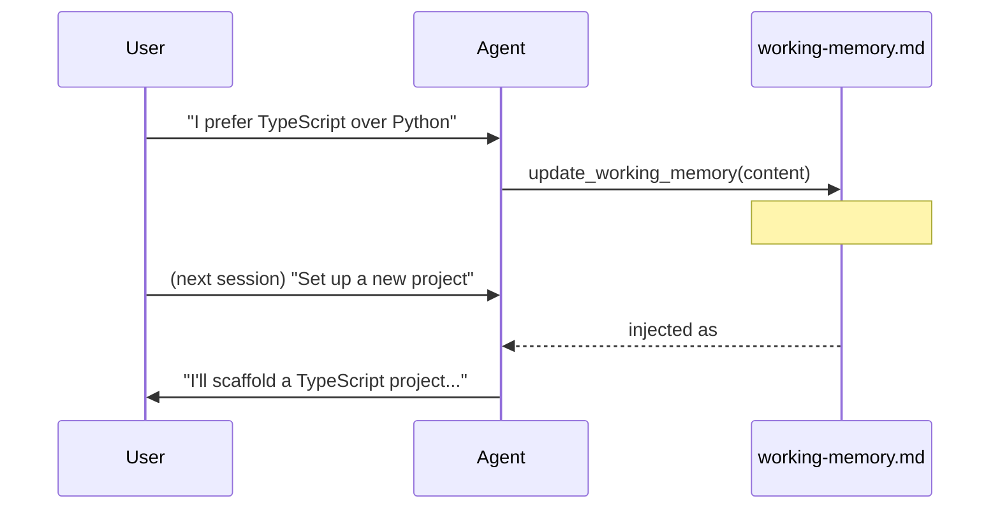

# Working Memory

> Your agent remembers things between conversations using a plain markdown file you can read and edit yourself.

---

## Where It Lives

```
~/.wunderland/agents/<seedId>/working-memory.md
```

This file is created automatically when an agent starts for the first time.

## How the Agent Uses It

On every conversation turn, the contents of `working-memory.md` are injected into the agent's prompt under a `## Persistent Memory` heading. The agent can update it by calling the `update_working_memory` tool — a full-file replacement with whatever it decides is worth remembering.



## Configuration

Set a custom template in `agent.config.json`:

```json
{
  "workingMemoryTemplate": "## Client Info\n\n## Open Tasks\n\n## Notes\n"
}
```

If omitted, the agent starts with a default template containing `User Preferences`, `Current Project`, and `Key Facts` sections.

The memory content is capped at 5% of the prompt token budget to keep context usage efficient.

## Manual Editing

The file is plain markdown. Open it in any editor to add, correct, or remove information:

```bash
vim ~/.wunderland/agents/my-agent/working-memory.md
```

Changes take effect on the next message — no restart needed. This is useful for:

- **Bootstrapping** — paste project context before the first conversation
- **Correcting** — fix something the agent got wrong
- **Pruning** — remove stale information to free up token budget

## Example Conversation

```
You:   My name is Alex and I work on the billing service.
Agent: Got it — I've saved that to my working memory.

        [tool call: update_working_memory]
        ## User Preferences
        - Name: Alex
        - Primary project: billing service

You:   (new session) What am I working on?
Agent: You're working on the billing service, Alex.
```

## Comparison with Cognitive Memory

Working memory is a **persistent notepad** — it survives restarts and is human-editable. The cognitive memory system (Baddeley model) is a separate, ephemeral in-session mechanism that handles short-term reasoning slots and activation decay. Both contribute to the prompt simultaneously.

See [Cognitive Memory](/docs/features/cognitive-memory) for the in-session memory system.
