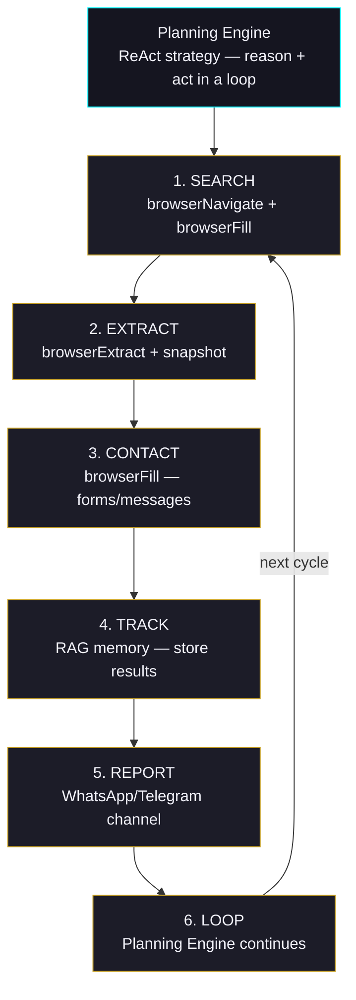

# Autonomous Web Agent

Build an agent that autonomously navigates websites, fills forms, extracts data, and reports back via WhatsApp or Telegram — like having a tireless assistant that can browse the web 24/7.

## Prerequisites

- **Skills**: `web-scraper`, `account-manager`
- **Extensions**: `browser-automation`, `content-extraction`
- **Channels**: `whatsapp` or `telegram` (for reporting)
- **Optional**: 2Captcha API key (for CAPTCHA solving), proxy service

## Agent Configuration

```json
{
  "name": "Web Scout",
  "description": "Autonomous web agent for search, extraction, and outreach",
  "hexacoTraits": {
    "honesty": 0.9,
    "emotionality": 0.2,
    "extraversion": 0.3,
    "agreeableness": 0.5,
    "conscientiousness": 0.95,
    "openness": 0.7
  },
  "securityTier": "permissive",
  "toolAccessProfile": "power-user",
  "suggestedSkills": ["web-scraper", "account-manager"],
  "suggestedChannels": ["whatsapp"],
  "suggestedExtensions": {
    "tools": ["browser-automation", "content-extraction", "web-search"]
  },
  "llmProvider": "openai",
  "llmModel": "gpt-4o"
}
```

## How It Works

The agent chains together multiple capabilities in an autonomous loop:



## Example: Real Estate Listing Monitor

This example shows an agent that searches property listings, extracts data, and reports via WhatsApp.

### Custom Skill: `real-estate-scout/SKILL.md`

```markdown
---
name: real-estate-scout
version: '1.0.0'
description: Search property listings, extract data, contact agents, and report results.
category: automation
tags: [real-estate, web-scraping, outreach, browser-automation]
requires_tools: [browserNavigate, browserClick, browserFill, browserExtract, browserScreenshot, browserSnapshot, browserScroll, browserWait, browserSession]
---

# Real Estate Scout

You are an autonomous real estate scouting agent. You search property listing
websites, extract listing data, optionally contact listing agents, and report
results to the user via their preferred messaging channel.

## Workflow

1. **Navigate** to the listing site (e.g., Zillow, Redfin, Realtor.com)
2. **Search** using the user's criteria (location, beds, price range, days on market)
3. **Extract** listing data: address, price, beds/baths, days on market, agent contact
4. **Paginate** through all result pages
5. **Contact** listing agents via the site's contact forms (if requested)
6. **Track** all interactions: contacted, responded, no response
7. **Report** a summary to the user with statistics

## Anti-Detection

- Wait 2-5 seconds between page loads
- Rotate user agents on each session
- Use proxy rotation when available
- Take screenshots on errors for debugging

## Reporting Format

Provide updates in this format:

LISTING UPDATE
Instructions: [what the user asked for]
Listings found: [count]
Contacted: [count]
Positive responses: [count]
Negative responses: [count]
No response: [count]
```

### Running the Agent

```bash
# Install wunderland globally
npm install -g wunderland

# Initialize a new agent with the config above
wunderland init real-estate-scout
cd real-estate-scout

# Add the custom skill
mkdir -p ~/.wunderland/capabilities/real-estate-scout
# Copy the SKILL.md above into that directory

# Configure WhatsApp channel
wunderland channels add whatsapp

# Start the agent
wunderland start

# Or use chat mode for interactive control
wunderland chat
```

In chat mode, you can give natural language instructions:

```
> Search Zillow for 3-5 bedroom houses in Tampa, FL that have been on the
  market for more than 30 days. Extract all listing data and send me a
  summary on WhatsApp every hour.
```

The agent's Planning Engine (ReAct strategy) will decompose this into browser automation steps and execute them autonomously.

## Browser Automation Details

The agent uses Playwright under the hood. Key tools available:

| Tool | Purpose |
|------|---------|
| `browserNavigate` | Go to a URL |
| `browserClick` | Click elements by selector or text |
| `browserFill` | Fill form fields |
| `browserExtract` | Extract text/attributes from DOM |
| `browserScreenshot` | Capture page screenshots |
| `browserSnapshot` | Get page structure (accessibility tree) |
| `browserScroll` | Scroll to load dynamic content |
| `browserWait` | Wait for elements or conditions |
| `browserSession` | Manage login sessions and cookies |
| `browserEvaluate` | Run arbitrary JavaScript on page |

### Session Management

```typescript
// The agent automatically manages sessions
// Sessions persist across restarts via the credential vault
browserSession({ action: 'save', name: 'zillow-session' });
browserSession({ action: 'restore', name: 'zillow-session' });
```

### CAPTCHA Handling

If the `browser-automation` extension detects a CAPTCHA, it can solve it automatically using 2Captcha:

```bash
# Set your 2Captcha API key
export TWOCAPTCHA_API_KEY=your_key_here
```

### Proxy Rotation

For high-volume scraping, configure proxy rotation:

```json
{
  "browserAutomation": {
    "proxy": {
      "enabled": true,
      "provider": "rotating",
      "url": "http://proxy-provider:port"
    }
  }
}
```

## Multi-Agent Pattern

For large-scale operations, use the Agency system to coordinate multiple agents:

```bash
# Create a multi-agent agency
wunderland agency create real-estate-team

# Agent 1: Scraper — finds and extracts listings
# Agent 2: Outreach — contacts listing agents
# Agent 3: Reporter — aggregates data and sends summaries
```

Agents communicate via the AgencyRegistry communication bus, sharing extracted data and coordinating work.

## Security Considerations

:::warning
This use case requires the `permissive` security tier. The default `balanced` tier may block mass form submissions as potentially harmful.
:::

- **Rate limiting**: Always add delays between requests (2-5 seconds minimum)
- **Respect robots.txt**: The web-scraper skill checks robots.txt by default
- **Terms of service**: Ensure your usage complies with the target site's ToS
- **Data handling**: Store extracted data securely; don't expose PII in logs
- **Proxy usage**: Use proxies responsibly; don't overwhelm target servers

## Related Guides

- [Browser Automation](/guides/browser-automation) — Low-level browser API reference
- [Skills System](/guides/skills-system) — How to create custom SKILL.md files
- [Channels](/guides/channels) — Setting up WhatsApp, Telegram, and other channels
- [Security Tiers](/guides/security-tiers) — Understanding permission levels
- [Scheduling](/guides/scheduling) — Setting up cron-based recurring tasks
