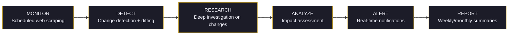

# Competitive Intelligence

Deploy an agent that monitors competitors, tracks pricing changes, aggregates industry news, and sends you actionable alerts via WhatsApp, Slack, or Telegram.

## Prerequisites

- **Skills**: `web-scraper`, `deep-research`, `summarize`
- **Extensions**: `browser-automation`, `content-extraction`, `web-search`, `news-search`
- **Channels**: `slack`, `telegram`, or `whatsapp` (for alerts)

## Agent Configuration

```json
{
  "name": "Market Analyst",
  "description": "Competitive intelligence and market monitoring agent",
  "hexacoTraits": {
    "honesty": 0.9,
    "emotionality": 0.15,
    "extraversion": 0.25,
    "agreeableness": 0.4,
    "conscientiousness": 0.95,
    "openness": 0.8
  },
  "securityTier": "balanced",
  "toolAccessProfile": "assistant",
  "suggestedSkills": ["web-scraper", "deep-research", "summarize"],
  "suggestedExtensions": {
    "tools": [
      "browser-automation",
      "content-extraction",
      "web-search",
      "news-search"
    ]
  },
  "suggestedChannels": ["slack", "telegram"]
}
```

:::tip Low Agreeableness for Sharp Analysis
An agreeableness of 0.4 means the agent won't sugarcoat findings — it will give you direct, honest competitive assessments.
:::

## Monitoring Pipeline



## Use Case 1: Price Monitoring

Track competitor pricing and get alerts on changes:

```bash
wunderland chat

> Monitor pricing pages for these competitors:
  - competitor-a.com/pricing
  - competitor-b.com/pricing
  - competitor-c.com/pricing
  Check every 6 hours. Alert me on Slack immediately
  if any prices change. Include the old price, new price,
  and percentage change.
```

The agent will:
1. Navigate to each pricing page via `browserNavigate`
2. Extract pricing data via `browserExtract`
3. Store in RAG memory with timestamps
4. Compare against previous snapshots
5. Send Slack alert if changes detected

### Alert Format

```
PRICE CHANGE DETECTED

Competitor: competitor-a.com
Plan: Enterprise
Old price: $299/mo
New price: $249/mo
Change: -16.7%

Analysis: This appears to be a response to our recent
pricing update. They've undercut our $279 Enterprise
plan by $30/mo. Consider reviewing our pricing strategy.
```

## Use Case 2: Product & Feature Tracking

Monitor competitor product launches and feature updates:

```bash
wunderland chat

> Track these competitors for product changes:
  - Monitor their changelog/release notes pages
  - Watch their blog for product announcements
  - Scan their Twitter for feature teasers
  - Check ProductHunt for new launches
  Send me a weekly roundup on Telegram.
```

### Scheduled Monitoring

```bash
# Check changelogs daily
wunderland cron add --name "changelog-monitor" \
  --schedule "0 7 * * *" \
  --task "Check competitor changelog pages for new entries. \
          Compare to last known state. Alert if new features found."

# Scan social media twice daily
wunderland cron add --name "social-monitor" \
  --schedule "0 8,16 * * *" \
  --task "Search Twitter and LinkedIn for competitor product \
          announcements. Summarize any findings."

# Weekly competitive report
wunderland cron add --name "competitive-weekly" \
  --schedule "0 9 * * 1" \
  --task "Compile weekly competitive intelligence report: \
          pricing changes, product updates, hiring signals, \
          press coverage, social sentiment. Send to Slack."
```

## Use Case 3: Industry Trend Detection

Monitor industry trends across multiple sources:

```bash
wunderland chat

> Monitor these sources for AI agent industry trends:
  - arXiv papers tagged with "autonomous agents"
  - r/MachineLearning and r/artificial on Reddit
  - HackerNews front page
  - TechCrunch and The Verge AI sections
  - Google News for "AI agents" and "autonomous AI"
  Identify emerging trends and send daily digest on Slack.
```

The agent uses `news-search` + `web-search` + `content-extraction` to aggregate sources, then `summarize` to distill key trends.

## Use Case 4: Hiring Signal Analysis

Competitor hiring patterns reveal strategic direction:

```bash
wunderland chat

> Monitor job postings for these companies:
  - competitor-a.com/careers
  - competitor-b.com/jobs
  Track new roles, especially in AI/ML, security, and
  infrastructure. Flag unusual hiring patterns (sudden
  burst of ML engineers = potential new AI product).
```

## RAG Memory for Historical Analysis

All monitoring data accumulates in RAG memory, enabling historical queries:

```bash
wunderland chat

> How has competitor-a's pricing changed over the
  last 3 months? Show me the trend.

> What new features did competitor-b launch this quarter
  compared to last quarter?

> Which competitor is hiring the most aggressively
  in AI/ML right now?
```

The agent's knowledge graph tracks relationships:

```
[Competitor A] --LAUNCHED--> [Feature X] --ON_DATE--> [2026-02-15]
[Competitor A] --CHANGED_PRICE--> [Enterprise Plan] --FROM--> [$299]
[Competitor B] --HIRING--> [ML Engineer] --COUNT--> [12 open roles]
```

## Multi-Channel Alerts

Configure different alert urgency levels for different channels:

```bash
# Immediate alerts (price changes, major announcements) → Slack DM
wunderland channels add slack --webhook-url $SLACK_WEBHOOK

# Daily digest → Email
wunderland channels add email --smtp-host smtp.gmail.com

# Weekly report → Telegram
wunderland channels add telegram --bot-token $TELEGRAM_TOKEN
```

The agent routes alerts based on urgency:
- **Critical** (pricing change, major launch): Slack DM immediately
- **Important** (new feature, hiring spike): Daily digest email
- **Informational** (blog post, social mention): Weekly report

## Security Considerations

- **Scraping frequency**: Space requests at least 5 seconds apart to avoid detection
- **Rate limits**: Use the `balanced` security tier (default)
- **robots.txt**: Agent respects robots.txt by default
- **Data storage**: Competitive data stored locally in RAG memory — not shared externally
- **Legal**: Only scrape publicly available information

## Related Guides

- [Autonomous Web Agent](/use-cases/autonomous-web-agent) — Browser automation for web tasks
- [Deep Research Agent](/use-cases/deep-research-agent) — Multi-source research
- [Browser Automation](/guides/browser-automation) — Low-level browser API
- [Scheduling](/guides/scheduling) — Cron-based monitoring
- [Channels](/guides/channels) — Alert delivery channels
